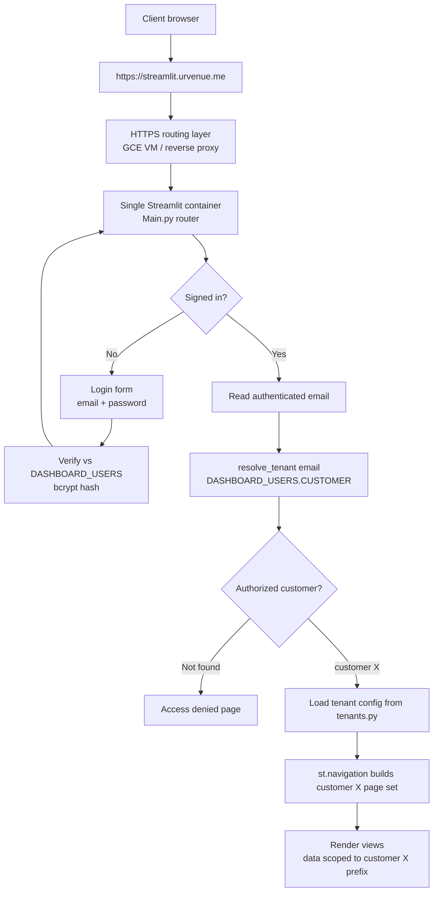
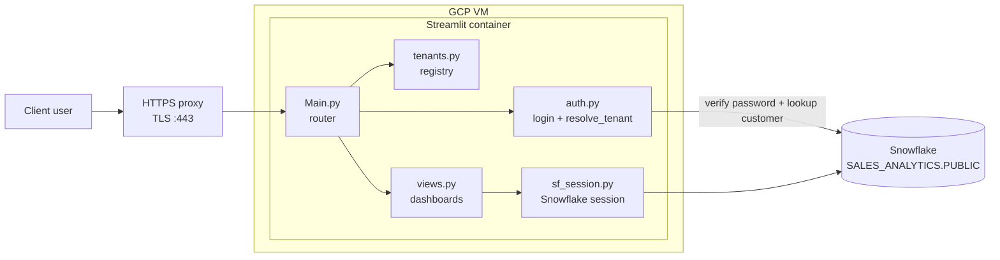
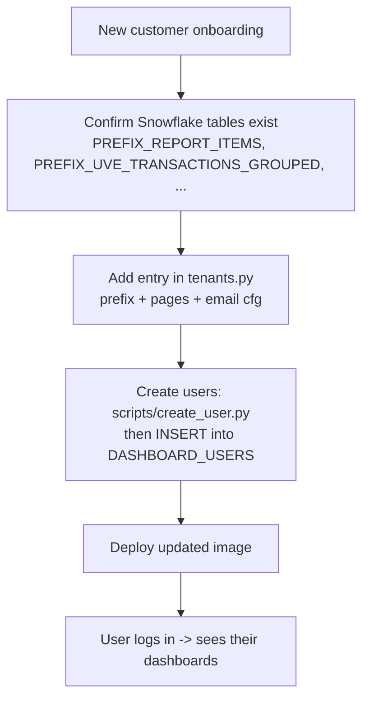

# UrVenue Analytics — Multi-Tenant Streamlit Dashboard

A **single-container, multi-tenant** Streamlit app that serves per-customer analytics
dashboards backed by **Snowflake**, gated by **username/password login** (credentials
stored in Snowflake as bcrypt hashes, via `streamlit-authenticator`).

One deployment (`https://streamlit.urvenue.me`) serves every customer. The signed-in
user's email decides which customer's dashboards and data they see — customers never
share a URL, a container, or each other's data.

> Infra/hosting for this app is tracked in **INF-212**; the app itself in the **DATA** project.

---

## App flow



## Components



---

## Project structure

| File | Responsibility |
|------|----------------|
| `Main.py` | Entrypoint/router: login → resolve customer → build that customer's `st.navigation` page set |
| `auth.py` | `require_login()` (username/password via `streamlit-authenticator`) + `resolve_tenant(email)` |
| `tenants.py` | **Tenant registry** — `customer → {prefix, page set, per-page template params}` |
| `views.py` | Generic, tenant-parameterized dashboards (`product_performance`, `attendance`, `email_campaigns`) |
| `sf_session.py` | Snowflake Snowpark session (key-pair / JWT auth) |
| `scripts/create_user.py` | Hash a password (bcrypt) + print the `DASHBOARD_USERS` INSERT |
| `requirements.txt` | Pinned, verified dependency set (Streamlit 1.58 + streamlit-authenticator 0.4.2) |
| `.streamlit/` | `config.toml` (committed) + `secrets.toml` (gitignored) — see `secrets.toml.example` |

See [`docs/ARCHITECTURE.md`](docs/ARCHITECTURE.md) for the login sequence, data-isolation, and deployment diagrams.

---

## Multi-tenant model — two config layers

| Layer | Answers | Where it lives | Changes |
|-------|---------|----------------|---------|
| **Users / permissions** | *Who is this user (password), and which customer?* | Snowflake `DASHBOARD_USERS(EMAIL, NAME, PASSWORD_HASH, CUSTOMER, ACTIVE)` | Often (clients added/removed) |
| **Template** | *What does that customer's dashboard look like?* | `tenants.py` registry (in code) | With releases |

**Per-customer templates** are pure config. Example — Abbaye vs Rimrock use the *same* email code with different config:

- **Abbaye** → raw `ABBAYE_MANDRILL_NOTIFICATIONS`, filter by subject, buckets `days:15` / `days:0`
- **Rimrock** → pre-deduped `RIMROCK_MANDRILL_NOTIFICATION_VIEW`, `EXTRA`/`SUBJECT` fields, buckets `30`/`60`/`90`

Customers can also have **different page sets**. For a genuinely bespoke customer, a page key can point at a custom function in `views.py`.

### Data-isolation guarantees
- The customer is resolved **server-side from the authenticated email only** — never from URL params or UI controls.
- `@st.cache_data` loaders are keyed by the fully-qualified table name (`{PREFIX}_*`), so cache entries are **per-tenant** — no cross-customer leakage.
- DB errors are **sanitized** (generic message, no SQL/table names leaked to end users).
- Passwords are stored **only as bcrypt hashes** in Snowflake — never plaintext, never logged.

---

## Adding a new customer



1. **Confirm data** — the customer's `PREFIX_*` tables exist in `SALES_ANALYTICS.PUBLIC`.
2. **Register the tenant** — add a `TENANTS["customer"]` entry in `tenants.py`.
3. **Create logins** — run `scripts/create_user.py` for each user (bcrypt-hashes the password) and run the printed `INSERT` into `DASHBOARD_USERS` with that user's `CUSTOMER`.
4. **Deploy** the updated image. No new container, route, or auth provider needed.

---

## Local development

```bash
python3.11 -m venv venv
./venv/bin/python -m pip install -r requirements.txt
# add .streamlit/secrets.toml (see secrets.toml.example) + the key-pair .pem
./venv/bin/python -m streamlit run Main.py     # http://localhost:8501
```

For local preview without the login form, set `[access] dev_bypass = true` and
`dev_tenant = "abbaye"` in `secrets.toml`. **Remove both for any hosted deployment.**

> Requires Python 3.11. Run via `python -m streamlit …` (not the `streamlit` console
> script). Keep **cryptography==42.0.8** pinned — it must stay `<43` for
> `snowflake-connector-python`.

---

## Configuration & secrets

All secrets live in `.streamlit/secrets.toml` (gitignored). See
[`.streamlit/secrets.toml.example`](.streamlit/secrets.toml.example): `[snowflake]`,
`[cookie]` (session-cookie signing key), and `[access]` (local dev bypass). **User
credentials are not in secrets** — they're in the Snowflake `DASHBOARD_USERS` table.

---

## Deployment (INF-212)

| Infrastructure owns | App/dev team owns (this repo) |
|---------------------|-------------------------------|
| HTTPS/TLS at `streamlit.urvenue.me` | Username/password login (bcrypt, `streamlit-authenticator`) |
| Routing to the single container | Email → customer resolution |
| Secret injection into the container | Per-customer routing & templates |
| Firewall (80/443 only) | Tenant-scoped queries + tenant-aware caching |
| Logs / restart policy / monitoring | User provisioning; blocking unauthorized users |

The team hosting builds/runs the image and injects `secrets.toml` (or the individual
values) as a mounted secret — the `.pem` and secrets are never baked into the image.
No external OAuth provider or callback URL is required.
