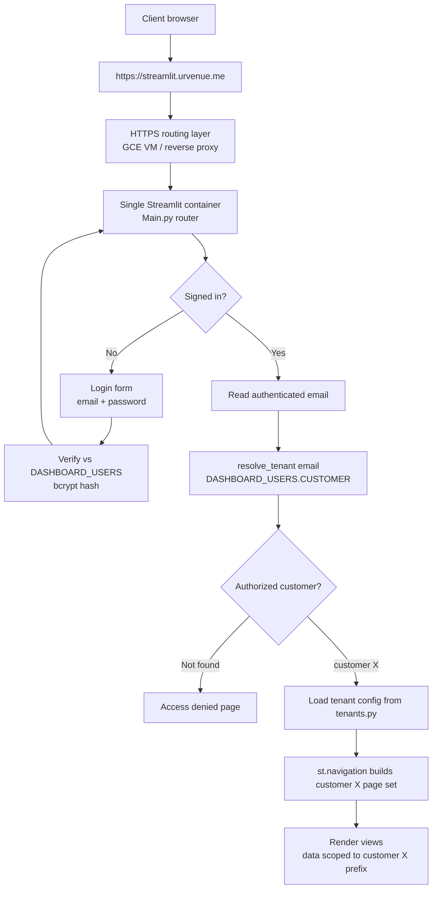
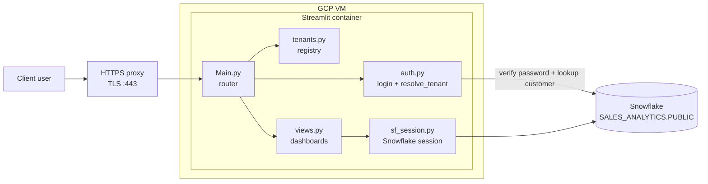
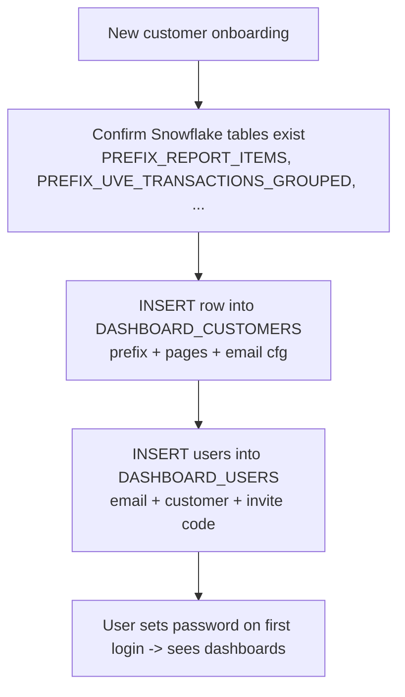

# UrVenue Analytics — Multi-Tenant Streamlit Dashboard

A **single-container, multi-tenant** Streamlit app that serves per-customer analytics
dashboards backed by **Snowflake**, gated by **username/password login** (credentials
stored in Snowflake as bcrypt hashes, via `streamlit-authenticator`).

One deployment (`https://streamlit.urvenue.me`) serves every customer. The signed-in
user's email decides which customer's dashboards and data they see — customers never
share a URL, a container, or each other's data.

> Infra/hosting for this app is tracked in **INF-212**; the app itself in the **DATA** project.

---

## App flow



## Components



---

## Project structure

| File | Responsibility |
|------|----------------|
| `Main.py` | Entrypoint/router: login → resolve customer → build that customer's `st.navigation` page set |
| `auth.py` | `require_login()` + set/change password (bcrypt → Snowflake) + `resolve_tenant(email)` |
| `tenants.py` | Loads the tenant registry from Snowflake `DASHBOARD_CUSTOMERS` (in-code fallback for local dev) |
| `views.py` | Generic, tenant-parameterized dashboards — page keys `product_performance`, `book_date`, `event_date`, `email_campaigns`, `guest_portal`, `audience`. Every table and chart exposes a per-widget **CSV download** (via the `_dl()` helper) |
| `sf_session.py` | Snowflake Snowpark session (key-pair / JWT auth) |
| `scripts/create_user.py` | Hash a password (bcrypt) + print the `DASHBOARD_USERS` INSERT |
| `requirements.txt` | Pinned, verified dependency set (Streamlit 1.58 + streamlit-authenticator 0.4.2) |
| `.streamlit/` | `config.toml` (committed) + `secrets.toml` (gitignored) — see `secrets.toml.example` |

See [`docs/ARCHITECTURE.md`](docs/ARCHITECTURE.md) for the login sequence, data-isolation, and deployment diagrams.

---

## Multi-tenant model — two config layers

| Layer | Answers | Where it lives | Changes |
|-------|---------|----------------|---------|
| **Users / permissions** | *Who is this user (password), and which customer?* | Snowflake `DASHBOARD_USERS(EMAIL, NAME, PASSWORD_HASH, CUSTOMER, INVITE_CODE, ACTIVE)` | Often (clients added/removed) |
| **Template + data source** | *What does that customer see, from which tables, and (for GA4 pages) which GA connector views?* | Snowflake `DASHBOARD_CUSTOMERS(CUSTOMER, LABEL, PREFIX, PAGES, EMAIL_CONFIG, GA4_CONFIG)` | In Snowflake |

`DASHBOARD_CUSTOMERS` is a **registry — one independent row per property**. Each row is
self-contained (its own `PREFIX`, `PAGES`, `EMAIL_CONFIG`, `GA4_CONFIG`); properties share
nothing but the table. Both control tables live in Snowflake, so adding/re-pointing a
customer is inserts/updates — **no code deploy** (only brand-new *page types* need code).

> **Current state:** `DASHBOARD_CUSTOMERS` is **seeded with the Abbaye row** (GA4 config
> included), so Abbaye now runs from Snowflake config, not the fallback. `DASHBOARD_USERS`
> is still empty — add user rows to enable login (local dev uses `dev_bypass`). See
> [`docs/ARCHITECTURE.md`](docs/ARCHITECTURE.md#setup-state--seeding).

**Per-customer templates** are pure config. Example — Abbaye vs Rimrock use the *same* email code with different config:

- **Abbaye** → raw `ABBAYE_MANDRILL_NOTIFICATIONS`, filter by subject, buckets `days:15` / `days:0`
- **Rimrock** → pre-deduped `RIMROCK_MANDRILL_NOTIFICATION_VIEW`, `EXTRA`/`SUBJECT` fields, buckets `30`/`60`/`90`

Customers can also have **different page sets**. For a genuinely bespoke customer, a page key can point at a custom function in `views.py`.

**Guest Portal & Audience (GA4):** these two pages are sourced from **Google Analytics (GA4)** via the Snowflake Connector for Google Analytics — one report per grain, each landing as a `{report}_GA4_{GRAIN}` view in the connector's destination schema. The app reads those per-grain views directly (location + report base configured in `DASHBOARD_CUSTOMERS.GA4_CONFIG`) and renders **with charts** to match Data Studio. Built and live for Abbaye. The Data Studio "Most Clicked Slides" widget needed a venue custom dimension the connector doesn't expose, so "Most Visited Experiences" substitutes `itemName` ranked by `itemsViewed`. Data model: [`docs/ARCHITECTURE.md`](docs/ARCHITECTURE.md#4-data-model).

### Data-isolation guarantees
- The customer is resolved **server-side from the authenticated email only** — never from URL params or UI controls.
- `@st.cache_data` loaders are keyed by the fully-qualified table name (`{PREFIX}_*`), so cache entries are **per-tenant** — no cross-customer leakage.
- DB errors are **sanitized** (generic message, no SQL/table names leaked to end users).
- Passwords are stored **only as bcrypt hashes** in Snowflake — never plaintext, never logged.

---

## Adding a new customer



1. **Confirm data** — the customer's `PREFIX_*` tables exist in `SALES_ANALYTICS.PUBLIC`; for the GA4 pages, its GA connector views exist (`{report}_GA4_*`).
2. **Register the customer** — `INSERT` one row into `DASHBOARD_CUSTOMERS` (prefix, pages, email config, and `GA4_CONFIG` if it has Guest Portal / Audience).
3. **Add users** — `INSERT` into `DASHBOARD_USERS` (email + customer, optional invite code). Each user sets their own password on first login (or use `scripts/create_user.py` to pre-hash one).
4. **No code deploy** — it's all data. (A brand-new *page type* is the only thing that needs code.)

**Passwords:** first-login set (email + invite code), sidebar "Change password" (current + new), and admin reset (`UPDATE DASHBOARD_USERS SET PASSWORD_HASH = NULL …`) — all store bcrypt hashes; see [`docs/ARCHITECTURE.md`](docs/ARCHITECTURE.md#4-data-model).

---

## Local development

```bash
python3.11 -m venv venv
./venv/bin/python -m pip install -r requirements.txt
# add .streamlit/secrets.toml (see secrets.toml.example) + the key-pair .pem
./venv/bin/python -m streamlit run Main.py     # http://localhost:8501
```

For local preview without the login form, set `[access] dev_bypass = true` and
`dev_tenant = "abbaye"` in `secrets.toml`. **Remove both for any hosted deployment.**

> Requires Python 3.11. Run via `python -m streamlit …` (not the `streamlit` console
> script). Keep **cryptography==42.0.8** pinned — it must stay `<43` for
> `snowflake-connector-python`.

---

## Configuration & secrets

All secrets live in `.streamlit/secrets.toml` (gitignored). See
[`.streamlit/secrets.toml.example`](.streamlit/secrets.toml.example): `[snowflake]`,
`[cookie]` (session-cookie signing key), and `[access]` (local dev bypass). **User
credentials are not in secrets** — they're in the Snowflake `DASHBOARD_USERS` table.

---

## Deployment (INF-212)

| Infrastructure owns | App/dev team owns (this repo) |
|---------------------|-------------------------------|
| HTTPS/TLS at `streamlit.urvenue.me` | Username/password login (bcrypt, `streamlit-authenticator`) |
| Routing to the single container | Email → customer resolution |
| Secret injection into the container | Per-customer routing & templates |
| Firewall (80/443 only) | Tenant-scoped queries + tenant-aware caching |
| Logs / restart policy / monitoring | User provisioning; blocking unauthorized users |

The team hosting builds/runs the image and injects `secrets.toml` (or the individual
values) as a mounted secret — the `.pem` and secrets are never baked into the image.
No external OAuth provider or callback URL is required.

### Container image

[`Dockerfile`](Dockerfile) builds on the shared Streamlit base image in GCP Artifact
Registry (`us-central1-docker.pkg.dev/urvenue-social/urvenue-streamlit/base:v1.0`),
installs the pinned dependencies, and copies the app. Secrets and the key-pair `.pem`
are **runtime mounts**, never baked in (enforced by [`.dockerignore`](.dockerignore)).

```bash
# 1. Auth to Artifact Registry (once)
gcloud auth configure-docker us-central1-docker.pkg.dev

# 2. Build
docker build -t us-central1-docker.pkg.dev/urvenue-social/urvenue-streamlit/analytics-dashboard:v1.0 .

# 3. Run locally to smoke-test (mount secrets + key at runtime)
docker run -p 8501:8501 \
  -v "$PWD/.streamlit/secrets.toml:/app/.streamlit/secrets.toml:ro" \
  -v "$PWD/svc_reports_key_1.pem:/app/svc_reports_key_1.pem:ro" \
  us-central1-docker.pkg.dev/urvenue-social/urvenue-streamlit/analytics-dashboard:v1.0

# 4. Push for INF-212 to deploy
docker push us-central1-docker.pkg.dev/urvenue-social/urvenue-streamlit/analytics-dashboard:v1.0
```

> In production, mount a `secrets.toml` with `dev_bypass` removed/commented (login required)
> and the `private_key_file` path pointing at the mounted `.pem` (`svc_reports_key_1.pem`,
> resolved relative to `/app`).
