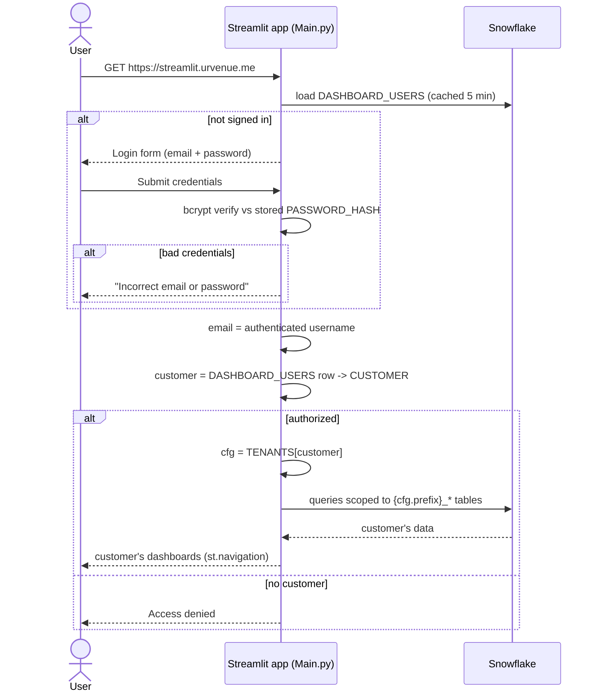
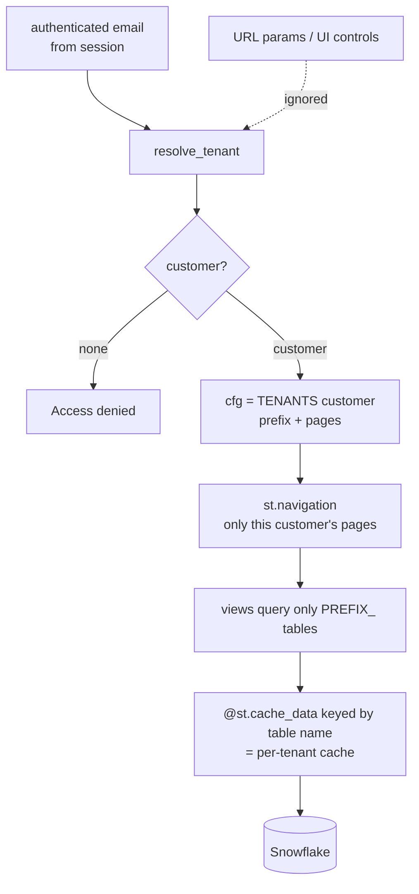
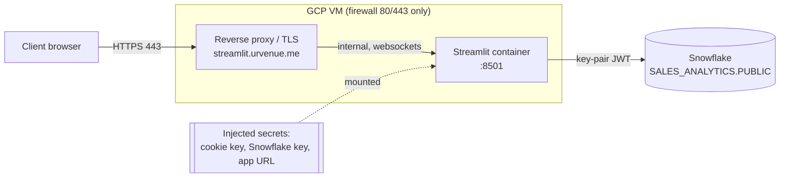

# Architecture

Deep-dive for the multi-tenant Streamlit analytics app. See the top-level
[`README.md`](../README.md) for the overview, app-flow, and component diagrams.

---

## 1. Login & tenant resolution (sequence)



Notes:
- `require_login()` renders the `streamlit-authenticator` login form and blocks until
  `st.session_state["authentication_status"]` is `True` (or local `dev_bypass`).
- Credentials come from `DASHBOARD_USERS` (bcrypt hashes), loaded with
  `@st.cache_data(ttl=300)`; `auto_hash=False` since the hashes are pre-computed.
- A signed session cookie (`[cookie]` in secrets) keeps the user logged in across reruns.
- Failed-login lockout is enabled (`max_login_attempts=5`).

---

## 2. Tenant scoping & data isolation



**Isolation invariants**
1. **Customer comes only from the authenticated email** — no `?customer=` param,
   page-path, or UI selector can change it.
2. **Every query is prefixed** by `cfg["prefix"]`. Views never build SQL from user input.
3. **Cache keys are per-tenant** — `@st.cache_data` loaders take the fully-qualified
   table name, so one customer's cached rows are never served to another.
4. `@st.cache_resource` (the shared Snowflake session) is safe — the same service
   account is used for all tenants; isolation is enforced per-query.
5. **Passwords stored only as bcrypt hashes**; plaintext never persisted or logged.

---

## 3. Deployment / network (INF-212)



- Only `443` (and `80`→`443` redirect) is public; the Streamlit port stays internal.
- The proxy must support **WebSocket upgrade** and forward `X-Forwarded-Proto`/`Host`.
- Secrets are **injected at runtime** (mounted file / env), never baked into the image.
- **No external OAuth provider / callback URL** — authentication is entirely in-app
  against Snowflake.

---

## 4. Data model

All dashboards read `SALES_ANALYTICS.PUBLIC`, one table set per customer, prefixed by
the customer's code (`ABBAYE_`, `RIMROCK_`, `FAIRMONT_`, `CLL_`, `WHISTLER_`, `JASPER_`).

Every table and chart on every page exposes a **per-widget CSV download** (shared `_dl()`
helper → `st.download_button` with a unique key). Chart exports carry the chart's exact
underlying data (e.g. the daily sessions series, the funnel counts), not just the on-screen
tables.

| Suffix | Feeds |
|--------|-------|
| `_REPORT_ITEMS` | Product Performance (views, conversion, attendance, value) |
| `_UVE_TRANSACTIONS_GROUPED` | Book Date (`T_TRANSDATE`) & Event Date (`TI_CALDATE`) |
| `_MANDRILL_NOTIFICATIONS` / `_MANDRILL_NOTIFICATION_VIEW` | Email Campaigns |
| `{report}_GA4_{DAILY,EVENTS,ITEMS,DEVICE,LOCATION,SLIDES}` (GA connector schema) | Guest Portal & Audience — see below |

Two control tables in `SALES_ANALYTICS.PUBLIC` drive the whole app. **Both already exist**
but are **currently empty** — while empty (or unavailable), the app runs on an in-code
fallback registry (see [Setup state & seeding](#setup-state--seeding)). DDL shown for
reference / rebuilds:

### `DASHBOARD_USERS` — who logs in, and which customer
```sql
CREATE TABLE IF NOT EXISTS SALES_ANALYTICS.PUBLIC.DASHBOARD_USERS (
    EMAIL         VARCHAR NOT NULL,   -- login id (lowercased)
    NAME          VARCHAR,
    PASSWORD_HASH VARCHAR,            -- bcrypt hash; NULL until the user sets it
    CUSTOMER      VARCHAR NOT NULL,   -- must match DASHBOARD_CUSTOMERS.CUSTOMER
    INVITE_CODE   VARCHAR,            -- optional shared secret for first-time set-password
    ACTIVE        BOOLEAN DEFAULT TRUE,
    CREATED_AT    TIMESTAMP_NTZ DEFAULT CURRENT_TIMESTAMP()
);
```

### `DASHBOARD_CUSTOMERS` — each customer's data source + template
```sql
CREATE TABLE IF NOT EXISTS SALES_ANALYTICS.PUBLIC.DASHBOARD_CUSTOMERS (
    CUSTOMER     VARCHAR NOT NULL,    -- e.g. 'abbaye'
    LABEL        VARCHAR,
    PREFIX       VARCHAR NOT NULL,    -- data source -> PREFIX_REPORT_ITEMS, PREFIX_UVE_TRANSACTIONS_GROUPED
    PAGES        ARRAY,               -- which dashboards this customer sees
    EMAIL_CONFIG VARIANT,             -- per-customer Email Campaigns template (table, tag/subject fields, buckets)
    GA4_CONFIG   VARIANT,             -- Guest Portal + Audience: GA connector view location {database, schema, report}
    ACTIVE       BOOLEAN DEFAULT TRUE
);
```

`DASHBOARD_CUSTOMERS` is a **registry: one independent row per property**. Each row is
self-contained (its own `PREFIX`, `PAGES`, `EMAIL_CONFIG`, `GA4_CONFIG`) — properties share
nothing but the table. Onboarding a new property is a single `INSERT`, no code change.

`tenants.py` loads `DASHBOARD_CUSTOMERS` at runtime (cached, 5 min) and falls back to a
small in-code registry if the table is **unavailable or empty** (local dev, or before
seeding). `auth.py` loads `DASHBOARD_USERS`.

### Setup state & seeding

Current state (2026-07-13): both control tables exist in `SALES_ANALYTICS.PUBLIC`.
`DASHBOARD_CUSTOMERS` is **seeded with the Abbaye row** (PAGES incl. `guest_portal` /
`audience`, plus its `GA4_CONFIG`), so Abbaye loads its config from Snowflake — not the
fallback. `DASHBOARD_USERS` is still **empty**, so add user rows (or use local `dev_bypass`)
to sign in. The `GA4_CONFIG` column was added after the table was first created:

```sql
ALTER TABLE SALES_ANALYTICS.PUBLIC.DASHBOARD_CUSTOMERS ADD COLUMN IF NOT EXISTS GA4_CONFIG VARIANT;
```

To add another property, insert one more row (see
[`sql/01_control_tables.sql`](../sql/01_control_tables.sql)). A property with no GA4 leaves
`GA4_CONFIG` `NULL` and simply omits the `guest_portal` / `audience` page keys.

### Password lifecycle (all write bcrypt hashes back to `DASHBOARD_USERS.PASSWORD_HASH`)
- **Set (first login):** admin inserts a user with `PASSWORD_HASH` NULL (+ optional
  `INVITE_CODE`); the user sets their password via the "Set password" form (email +
  invite code + new password).
- **Change (logged in):** the sidebar "Change password" form (current + new).
- **Forgot (admin reset, no email):** `UPDATE DASHBOARD_USERS SET PASSWORD_HASH = NULL
  WHERE LOWER(EMAIL) = …;` → the user re-sets on next login.

`scripts/create_user.py` remains available to pre-hash a password for a direct INSERT.

### GA4 data — Guest Portal & Audience

Guest Portal and Audience are sourced from **GA4 via the Snowflake Connector for Google
Analytics** (aggregate). GA4's scope rules forbid mixing item-, event-, session-, and
geo-scoped fields in one report, so the connector pulls **one report per grain**. Each
report lands as its **own view** in the connector's destination schema —
`GOOGLE_ANALYTICS_AGGREGATE_DATA_DEST_DB.GOOGLE_ANALYTICS_AGGREGATE_DATA_DEST_SCHEMA` —
named `{report}_GA4_{GRAIN}` (e.g. `ABBAYE_PARIS_GA4_DAILY`). The app reads these
**per-grain views directly** (no union table needed); `views.py` joins/aggregates them
per widget in pandas.

Connector reports / views (per client):

| Grain (view suffix) | Dimensions | Metrics | Powers |
|---|---|---|---|
| `_GA4_ITEMS` | date, itemName | itemsViewed, itemsPurchased | Items Viewed / Purchased **+ Most Visited Experiences** |
| `_GA4_EVENTS` | date, eventName, sessionSource, hostName | sessions, eventCount, keyEvents | Funnel, Transactions |
| `_GA4_DAILY` | date, sessionSource, hostName | sessions, activeUsers, totalUsers, newUsers, screenPageViews, engagedSessions, userEngagementDuration, keyEvents | KPIs, Acquisition, Sessions/Users graphs, Conversion Rate |
| `_GA4_DEVICE` | date, deviceCategory, hostName | sessions | Device Category |
| `_GA4_LOCATION` | date, city, country, region, sessionSource, hostName | sessions, keyEvents | Top Locations |
| `_GA4_SLIDES`* | date, eventName, linkUrl, linkText | eventCount | *(not currently consumed — see note)* |

`itemName` is item-scoped, so the `_GA4_ITEMS` view can't carry `sessionSource`/`hostName`.
`keyEvents` and `userEngagementDuration` arrive as **VARCHAR** and are coerced to numeric in
the app. Conversion Rate uses `_GA4_DAILY.keyEvents` (the `_GA4_EVENTS` keyEvents column is 0).

Each customer's GA4 location + report base is configured, not hard-coded, in
`DASHBOARD_CUSTOMERS.GA4_CONFIG` (VARIANT), with an in-code fallback for local dev:

```json
{ "database": "GOOGLE_ANALYTICS_AGGREGATE_DATA_DEST_DB",
  "schema":   "GOOGLE_ANALYTICS_AGGREGATE_DATA_DEST_SCHEMA",
  "report":   "ABBAYE_PARIS" }
```

Filters applied in-app (from the Data Studio report): exclude `sessionSource` containing
tagassistant/uat/localhost/staging (also internal `atlassian`/`office.net` traffic); require
`hostName` contains `booketing`; `location` excludes `city = Morelia`. Guest Portal builds an
ordered event funnel (Guest Portal Loaded → Viewed → Selected → Add to Cart → Checkout →
Purchase).

Ratios are **computed in the app**, not stored: Conversion Rate = `keyEvents/sessions`;
% New Users = `newUsers/totalUsers`; Bounce Rate = `(sessions-engagedSessions)/sessions`;
Avg engagement = `userEngagementDuration/sessions`; Sessions per user = `sessions/totalUsers`.

\* **"Most Visited" — substituted with `itemName` / `itemsViewed`.** The original Data Studio
"Most Clicked Slides" widget breaks down by venue — the custom event parameter "get venue
selected" (`customEvent:<param>`) — which the Snowflake GA connector does not expose. The
`_GA4_SLIDES` report was set up to use `linkUrl`/`linkText` as a stand-in, but both came back
**empty on every row**, and `eventName` only names the *action type* (`view_item`,
`inventory_list_click`, …), never which item. So Guest Portal's **"Most Visited Experiences"**
widget uses `_GA4_ITEMS` — `itemName` ranked by `itemsViewed` (with per-item conversion) —
which is the actual per-content view count (e.g. `view_item` eventCount = total itemsViewed).
The `_GA4_SLIDES` grain is **not currently consumed**; revisit it only if/when the venue
custom dimension is added to the connector report.

---

## 5. Roadmap

- **Guest Portal** and **Audience** pages — ✅ **built** (`views.guest_portal` /
  `views.audience`, charts on, reading the per-grain GA4 connector views via
  `DASHBOARD_CUSTOMERS.GA4_CONFIG`). "Most Visited" uses `itemName`/`itemsViewed` as the venue
  substitute. Optional GA4 follow-up: add the venue custom dimension ("get venue selected") to
  the slides report for a true per-venue breakdown, and roll GA4 out to other clients (add each
  client's connector reports + a `GA4_CONFIG` row).
- `Dockerfile` on the GCP `base:v1.0` image, then hand off to INF-212 for hosting.
