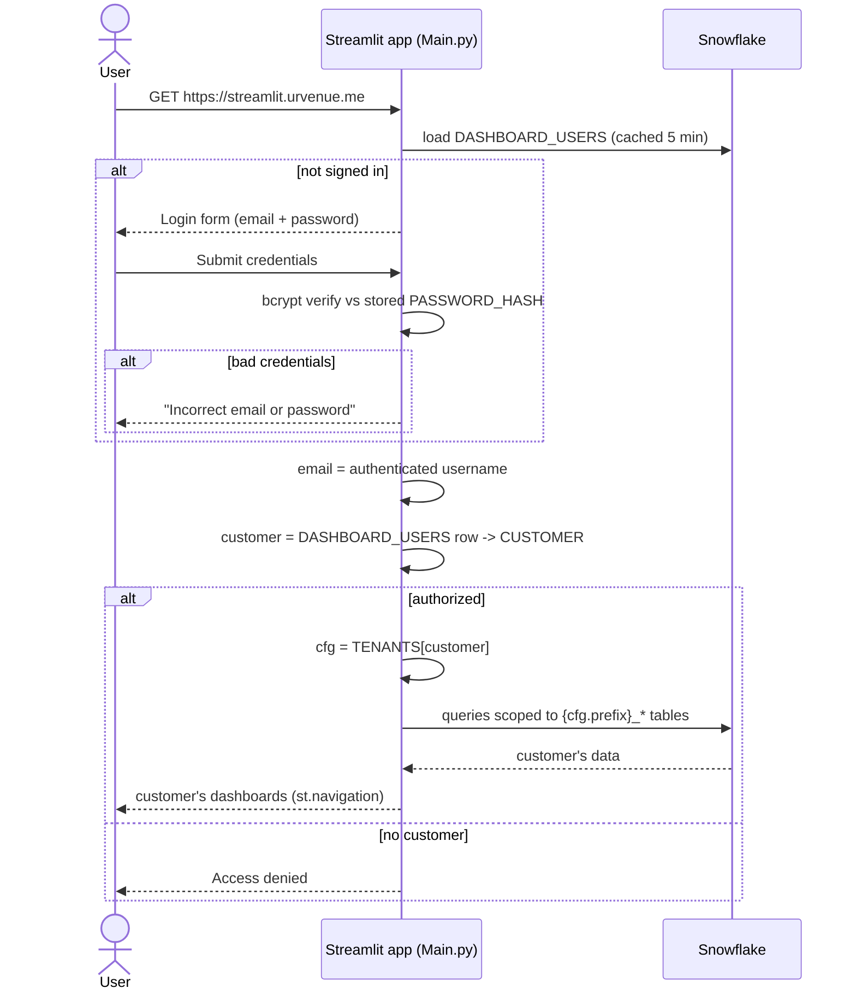
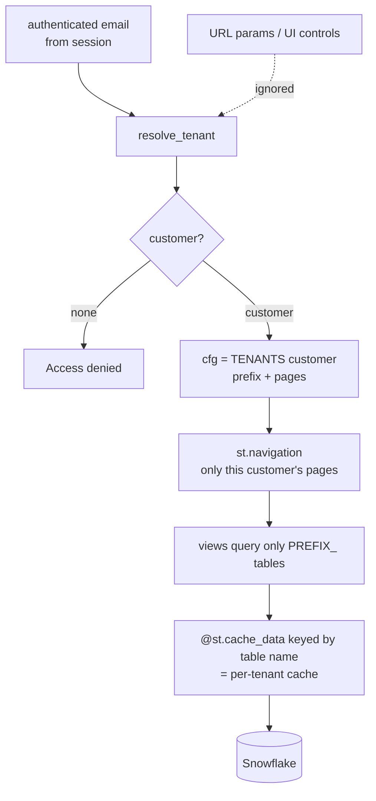
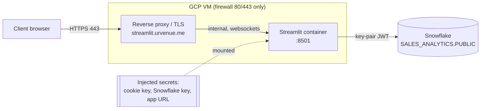

# Architecture

Deep-dive for the multi-tenant Streamlit analytics app. See the top-level
[`README.md`](../README.md) for the overview, app-flow, and component diagrams.

---

## 1. Login & tenant resolution (sequence)



Notes:
- `require_login()` renders the `streamlit-authenticator` login form and blocks until
  `st.session_state["authentication_status"]` is `True` (or local `dev_bypass`).
- Credentials come from `DASHBOARD_USERS` (bcrypt hashes), loaded with
  `@st.cache_data(ttl=300)`; `auto_hash=False` since the hashes are pre-computed.
- A signed session cookie (`[cookie]` in secrets) keeps the user logged in across reruns.
- Failed-login lockout is enabled (`max_login_attempts=5`).

---

## 2. Tenant scoping & data isolation



**Isolation invariants**
1. **Customer comes only from the authenticated email** — no `?customer=` param,
   page-path, or UI selector can change it.
2. **Every query is prefixed** by `cfg["prefix"]`. Views never build SQL from user input.
3. **Cache keys are per-tenant** — `@st.cache_data` loaders take the fully-qualified
   table name, so one customer's cached rows are never served to another.
4. `@st.cache_resource` (the shared Snowflake session) is safe — the same service
   account is used for all tenants; isolation is enforced per-query.
5. **Passwords stored only as bcrypt hashes**; plaintext never persisted or logged.

---

## 3. Deployment / network (INF-212)



- Only `443` (and `80`→`443` redirect) is public; the Streamlit port stays internal.
- The proxy must support **WebSocket upgrade** and forward `X-Forwarded-Proto`/`Host`.
- Secrets are **injected at runtime** (mounted file / env), never baked into the image.
- **No external OAuth provider / callback URL** — authentication is entirely in-app
  against Snowflake.

---

## 4. Data model

All dashboards read `SALES_ANALYTICS.PUBLIC`, one table set per customer, prefixed by
the customer's code (`ABBAYE_`, `RIMROCK_`, `FAIRMONT_`, `CLL_`, `WHISTLER_`, `JASPER_`).

| Suffix | Feeds |
|--------|-------|
| `_REPORT_ITEMS` | Product Performance (views, conversion, attendance, value) |
| `_UVE_TRANSACTIONS_GROUPED` | Book Date (`T_TRANSDATE`) & Event Date (`TI_CALDATE`) |
| `_MANDRILL_NOTIFICATIONS` / `_MANDRILL_NOTIFICATION_VIEW` | Email Campaigns |

### Users / permissions table (to be created)

```sql
CREATE TABLE IF NOT EXISTS SALES_ANALYTICS.PUBLIC.DASHBOARD_USERS (
    EMAIL         VARCHAR NOT NULL,   -- login id (lowercased)
    NAME          VARCHAR,
    PASSWORD_HASH VARCHAR NOT NULL,   -- bcrypt hash (see scripts/create_user.py)
    CUSTOMER      VARCHAR NOT NULL,   -- must match a key in tenants.TENANTS
    ACTIVE        BOOLEAN DEFAULT TRUE,
    CREATED_AT    TIMESTAMP_NTZ DEFAULT CURRENT_TIMESTAMP()
);
```

Seed a user: `python scripts/create_user.py <email> "<Name>" <customer>` → prints the
`INSERT` (with a bcrypt hash) to run in Snowflake.

### Tenant registry (`tenants.py`)

```python
TENANTS["<customer>"] = {
    "label":  "Display Name",
    "prefix": "PREFIX",                     # -> PREFIX_REPORT_ITEMS, PREFIX_UVE_... etc.
    "pages":  ["product_performance", "book_date", "event_date", "email_campaigns"],
    "email":  {                             # per-customer Email Campaigns template
        "table": "PREFIX_MANDRILL_NOTIFICATIONS",
        "tag_field": "NOTIFICATION_TAG",    # or "EXTRA" for a view
        "subject_field": "DATA_SUBJECT",    # or "SUBJECT"
        "subject_match": "…",               # ILIKE scope (multi-property source)
        "buckets": [("days:15", "Automatic Emails 15 days"), ...],
    },
}
```

---

## 5. Roadmap

- **Guest Portal** and **Audience** pages — sourced from **Google Analytics (GA4)** via
  the GA4 Data API — added as new page keys in `views.py` + `tenants.py` once GA4 access
  lands (DATA access ticket).
- `Dockerfile` on the GCP `base:v1.0` image, then hand off to INF-212 for hosting.
