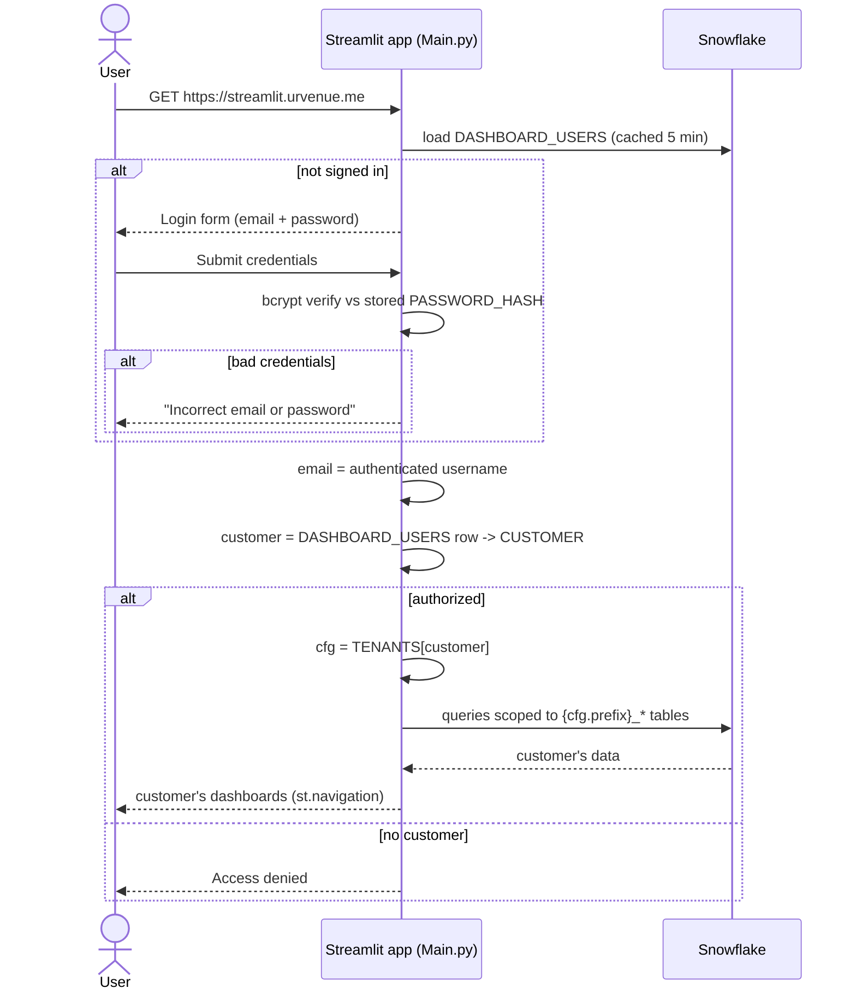
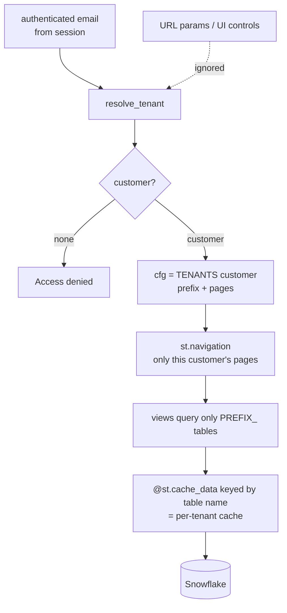
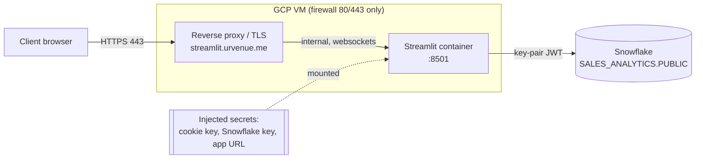

# Architecture

Deep-dive for the multi-tenant Streamlit analytics app. See the top-level
[`README.md`](../README.md) for the overview, app-flow, and component diagrams.

---

## 1. Login & tenant resolution (sequence)



Notes:
- `require_login()` renders the `streamlit-authenticator` login form and blocks until
  `st.session_state["authentication_status"]` is `True` (or local `dev_bypass`).
- Credentials come from `DASHBOARD_USERS` (bcrypt hashes), loaded with
  `@st.cache_data(ttl=300)`; `auto_hash=False` since the hashes are pre-computed.
- A signed session cookie (`[cookie]` in secrets) keeps the user logged in across reruns.
- Failed-login lockout is enabled (`max_login_attempts=5`).

---

## 2. Tenant scoping & data isolation



**Isolation invariants**
1. **Customer comes only from the authenticated email** — no `?customer=` param,
   page-path, or UI selector can change it.
2. **Every query is prefixed** by `cfg["prefix"]`. Views never build SQL from user input.
3. **Cache keys are per-tenant** — `@st.cache_data` loaders take the fully-qualified
   table name, so one customer's cached rows are never served to another.
4. `@st.cache_resource` (the shared Snowflake session) is safe — the same service
   account is used for all tenants; isolation is enforced per-query.
5. **Passwords stored only as bcrypt hashes**; plaintext never persisted or logged.

---

## 3. Deployment / network (INF-212)



- Only `443` (and `80`→`443` redirect) is public; the Streamlit port stays internal.
- The proxy must support **WebSocket upgrade** and forward `X-Forwarded-Proto`/`Host`.
- Secrets are **injected at runtime** (mounted file / env), never baked into the image.
- **No external OAuth provider / callback URL** — authentication is entirely in-app
  against Snowflake.

---

## 4. Data model

All dashboards read `SALES_ANALYTICS.PUBLIC`, one table set per customer, prefixed by
the customer's code (`ABBAYE_`, `RIMROCK_`, `FAIRMONT_`, `CLL_`, `WHISTLER_`, `JASPER_`).

| Suffix | Feeds |
|--------|-------|
| `_REPORT_ITEMS` | Product Performance (views, conversion, attendance, value) |
| `_UVE_TRANSACTIONS_GROUPED` | Book Date (`T_TRANSDATE`) & Event Date (`TI_CALDATE`) |
| `_MANDRILL_NOTIFICATIONS` / `_MANDRILL_NOTIFICATION_VIEW` | Email Campaigns |

Two control tables drive the whole app (create both):

### `DASHBOARD_USERS` — who logs in, and which customer
```sql
CREATE TABLE IF NOT EXISTS SALES_ANALYTICS.PUBLIC.DASHBOARD_USERS (
    EMAIL         VARCHAR NOT NULL,   -- login id (lowercased)
    NAME          VARCHAR,
    PASSWORD_HASH VARCHAR,            -- bcrypt hash; NULL until the user sets it
    CUSTOMER      VARCHAR NOT NULL,   -- must match DASHBOARD_CUSTOMERS.CUSTOMER
    INVITE_CODE   VARCHAR,            -- optional shared secret for first-time set-password
    ACTIVE        BOOLEAN DEFAULT TRUE,
    CREATED_AT    TIMESTAMP_NTZ DEFAULT CURRENT_TIMESTAMP()
);
```

### `DASHBOARD_CUSTOMERS` — each customer's data source + template
```sql
CREATE TABLE IF NOT EXISTS SALES_ANALYTICS.PUBLIC.DASHBOARD_CUSTOMERS (
    CUSTOMER     VARCHAR NOT NULL,    -- e.g. 'abbaye'
    LABEL        VARCHAR,
    PREFIX       VARCHAR NOT NULL,    -- data source -> PREFIX_REPORT_ITEMS, PREFIX_UVE_TRANSACTIONS_GROUPED
    PAGES        ARRAY,               -- which dashboards this customer sees
    EMAIL_CONFIG VARIANT,             -- per-customer Email Campaigns template (table, tag/subject fields, buckets)
    ACTIVE       BOOLEAN DEFAULT TRUE
);
```

`tenants.py` loads `DASHBOARD_CUSTOMERS` at runtime (cached, 5 min) and falls back to a
small in-code registry only if the table is unavailable (local dev). `auth.py` loads
`DASHBOARD_USERS`.

### Password lifecycle (all write bcrypt hashes back to `DASHBOARD_USERS.PASSWORD_HASH`)
- **Set (first login):** admin inserts a user with `PASSWORD_HASH` NULL (+ optional
  `INVITE_CODE`); the user sets their password via the "Set password" form (email +
  invite code + new password).
- **Change (logged in):** the sidebar "Change password" form (current + new).
- **Forgot (admin reset, no email):** `UPDATE DASHBOARD_USERS SET PASSWORD_HASH = NULL
  WHERE LOWER(EMAIL) = …;` → the user re-sets on next login.

`scripts/create_user.py` remains available to pre-hash a password for a direct INSERT.

### GA4 data — Guest Portal & Audience (`{PREFIX}_GA4`)

Guest Portal and Audience are sourced from **GA4 via the Snowflake Connector for Google
Analytics** (aggregate). GA4's scope rules forbid mixing item-, event-, session-, and
geo-scoped fields in one report, so the connector pulls **one report per grain** (each its
own table), which are unioned into a single per-client `{PREFIX}_GA4` table tagged by
`REPORT`.

Connector reports (per client):

| `REPORT` | Dimensions | Metrics | Powers |
|---|---|---|---|
| `items` | date, itemName | itemsViewed, itemsPurchased | Items Viewed / Purchased |
| `events` | date, eventName, sessionSource, hostName | sessions, eventCount, keyEvents | Funnel, Transactions, Conversion Rate |
| `daily` | date, sessionSource, hostName | sessions, activeUsers, totalUsers, newUsers, screenPageViews, engagedSessions, userEngagementDuration, keyEvents | Acquisition, Behavior, Sessions graph |
| `device` | date, deviceCategory, hostName | sessions | Device Category |
| `location` | date, city, country, region, sessionSource, hostName | sessions, keyEvents | Location |
| `slides`* | date, eventName, linkUrl, linkText | eventCount | Most Clicked Slides |

`itemName` is item-scoped, so the `items` report can't carry `sessionSource`/`hostName` —
filter it via the connector's Filters option instead. All other reports carry the filter
dimensions so the app can apply each widget's (differing) filters in-query.

Union table (REPORT-tagged long table; each row fills only its report's columns):

```sql
CREATE TABLE IF NOT EXISTS SALES_ANALYTICS.PUBLIC.{PREFIX}_GA4 (
    REPORT VARCHAR NOT NULL,                         -- items|events|daily|device|location|slides
    DATE DATE,
    ITEM_NAME VARCHAR, EVENT_NAME VARCHAR, DEVICE_CATEGORY VARCHAR,
    CITY VARCHAR, COUNTRY VARCHAR, REGION VARCHAR,
    LINK_URL VARCHAR, LINK_TEXT VARCHAR,             -- Most Clicked Slides (proxy for the venue)
    SESSION_SOURCE VARCHAR, HOST_NAME VARCHAR,       -- filter dimensions
    SESSIONS NUMBER, KEY_EVENTS NUMBER, ITEMS_VIEWED NUMBER, ITEMS_PURCHASED NUMBER,
    EVENT_COUNT NUMBER, ACTIVE_USERS NUMBER, TOTAL_USERS NUMBER, NEW_USERS NUMBER,
    SCREEN_PAGE_VIEWS NUMBER, ENGAGED_SESSIONS NUMBER, USER_ENGAGEMENT_DURATION FLOAT
);
```

Filters (Exclude `sessionSource` contains tagassistant/uat/localhost/staging; Include
`hostName` contains `booketing`; `location` also excludes `city = Morelia`; `device` uses
the host filter only; `events` funnel filters `eventName` to the 5 funnel steps; `slides`
filters `eventName` to `explore_slider_click`/`explore_sliders_externallink`).

Ratios are **computed in the app**, not stored: Conversion Rate = `KEY_EVENTS/SESSIONS`;
% New Users = `(TOTAL_USERS-NEW_USERS)/TOTAL_USERS`; Bounce Rate =
`(SESSIONS-ENGAGED_SESSIONS)/SESSIONS`; Avg engagement = `USER_ENGAGEMENT_DURATION/SESSIONS`;
Sessions per user = `SESSIONS/TOTAL_USERS`.

\* **Most Clicked Slides is pending a dimension.** The venue breakdown is the custom event
parameter "get venue selected" (`customEvent:<param>`), which the Snowflake GA connector
does not expose. `linkUrl`/`linkText` are proxies for the external-link slider event —
verify in a GA4 Explore that they carry the venue for both slide events, otherwise defer.

---

## 5. Roadmap

- **Guest Portal** and **Audience** pages — data model defined above (GA4 via the Snowflake
  Connector for Google Analytics → per-client `{PREFIX}_GA4`). Pending: create the per-grain
  connector reports + the union view, resolve the Most Clicked Slides dimension, then add
  the `guest_portal` + `audience` page keys to `views.py`/`tenants.py` (**charts on** for
  these two, to match Data Studio).
- `Dockerfile` on the GCP `base:v1.0` image, then hand off to INF-212 for hosting.
